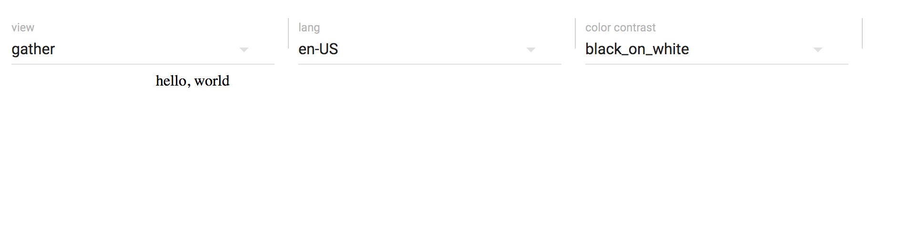
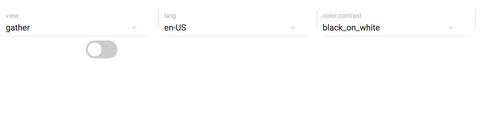
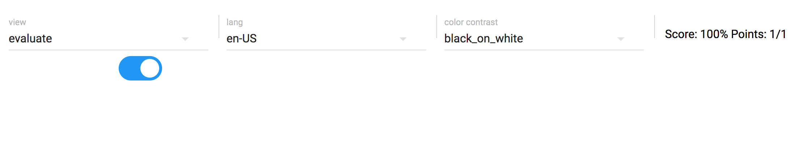
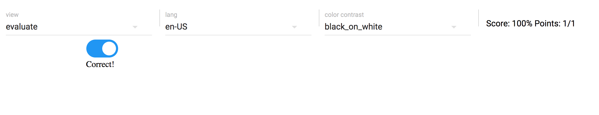

## Setting up your first PIE

To start creating a PIE, the first step is to create a directory and initialize the project. For the purposes of this explanation, we'll be developing a simple toggle with a value of either `true` or `false`.

    mkdir pie-toggle
    cd pie-toggle
    npm init

Using the interactive `npm` command, set the name of the interaction to `pie-toggle`, and set the "entry point" to `src/index.js`. Afterwards, there should be a `package.json` file in the directory which looks like this:

    {
      "name": "pie-toggle",
      "version": "1.0.0",
      "description": "",
      "main": "src/index.js",
      "scripts": {
        "test": "echo \"Error: no test specified\" && exit 1"
      },
      "author": "",
      "license": "ISC"
    }

It would also be useful to set up a README at this point:

    touch README.md

[See the code here](https://github.com/PieLabs/pie-toggle/commit/191fc3a4f29e282258b6df5582dfd40657c94822)

### Creating a Custom Element

To get started, we'll need to create a definition for our PIE [custom element](https://developers.google.com/web/fundamentals/getting-started/primers/customelements) in a `src` directory:

    mkdir src
    cd src
    touch index.js

Fill out this file with the following code:

    export default class Toggle extends HTMLElement {
      
      constructor() {
        super();
        this.innerHTML = [
          '
',
            "hello, world",
          '
'
        ].join('\n');
      }

    }

This defines a simple web component with the content 'hello, world'.

[See the code here](https://github.com/PieLabs/pie-toggle/commit/6bca8238da6f60e0303b990c104cced869513ca7)

### Setting up demo code

Now that we've got some markup in our PIE, we'll need to define an item so that we can see it in action. For a  PIE, this is performed by adding data and markup to the demo. You'll want to create a `docs/demo` directory, and add to it a `config.json` file as well as an `index.html` file:

    mkdir -p docs/demo
    cd docs/demo
    touch index.html
    touch config.json

At this point, your project structure should look like this:

    .
    ├── docs
    │   └── demo
    │       ├── config.json
    │       └── index.html
    ├── package.json
    └── src
        └── index.js

In the `config.json` file, we'll need to define the configuration data to set up the PIE:

    {
      "elements": {
        "pie-toggle": "../.."
      },
      "models": [
        {
          "id": "1",
          "element": "pie-toggle"
        }
      ]
    }

The `elements` field tells `pie` where to find the source for a given element using its name. Note that you may also use NPM-style locations for this property as well. The `models` property defines the content of the various PIE instances to be rendered. At the moment, we're just setting a PIE referenced by `id=1` to be defined as a `pie-toggle`.

Once the PIE is configured in the JSON, we'll need to define the markup for rendering it in the `index.html` file:

    

    

      <pie-toggle pie-id="1"></pie-toggle>
    

Once this is done, we have the base setup for our PIE.

[See the code here](https://github.com/PieLabs/pie-toggle/commit/d26f76aecd752fe926912a680f904c8259990481)

### Running the demo

In order to display our configured PIE in a browser, run the `serve` task from the `docs/demo` directory of the project:

    pie serve

Then navigate your browser to `http://localhost:4000`. You should see the "hello, world" message we entered earlier:

Towards the top of the screen you will see a control panel for changing the view mode, language settings, and color contrast for the item. (This is a subset of the properties that can be set for the environment - a complete set will be coming in an upcoming version of the control panel.)

The `pie serve` task enables **Hot Module Replacement** for your code. This means any changes you make in your Javascript code will be automatically updated in the page, you do not need to refresh the page or re-run the task. To try this out, open the `src/index.js` file and change the `hello world` message to something else - you will see this is immediately updated on the page.

### Adding data to the model

First off, we will introduce logic so that our PIE manages state and provides access to its `model` and `session` properties:

    export default class Toggle extends HTMLElement {
      
      constructor() {
        super();
        this._model = null;
        this._session = null;
        this._rerender();
      }

      set model(m) {
        this._model = m;
        this._rerender();
      }

      set session(s) {
        this._session = s;
        this._rerender();
      }

      get session() {
        return this._session;
      }

      _message() {
        return this._model ? this._model.message : 'hello, world';
      }

      _rerender() {
        this.innerHTML = [
          '
',
            this._message(),
          '
'
        ].join('\n');
      }

      connectedCallback() {
        this.dispatchEvent(new CustomEvent('pie.register', { bubbles: true }));
        this._rerender();
      }

    }

There's also a bit of glue code in here so that our component registers itself with the rest of the PIE framework. As you can see, if there is a `message` property defined in the model it will be rendered into the markup. We'll also need to change the `docs/demo/config.json` file to include a custom message:

    {
      "elements": {
        "pie-toggle": "../.."
      },
      "models": [
        {
          "id": "1",
          "element": "pie-toggle",
          "message": "hello, PIE"
        }
      ]
    }

At this point we will also need a controller for our PIE. Create a `controller` directory in the project root and initialize it using `npm` with the name `pie-toggle-controller` and the entry point `src/index.js`:

> Note: the requirement to define an NPM package for the controller is being removed. This will be an optional feature. See Pielabs/pie-cli#85.

    mkdir controller
    cd controller 
    npm init
    mkdir src
    cd src
    touch index.js

Paste the following into the `controller/src/index.js` file:

    export function outcome(question, session) {

      return new Promise((resolve) => {
        resolve({});
      });

    }

    export function model(question, session, env) {

      return new Promise((resolve) => {
        resolve(question);
      });

    }

Now open `http://localhost:4000`, and you will see that the message has now been replaced with "hello, PIE".

[See the code here](https://github.com/PieLabs/pie-toggle/commit/b7a20539d4a5168a0b2fdfb70841ffa1f2ad8b86)

### Add some interactive elements

At this point, it'll be useful to add some styling and interaction to our PIE. Start with adding the `less` module to NPM from the root directory of the project:

    npm install less --save

Then add the following to `src/index.less` so that we have some styling for our toggle:

    .switch {
      position: relative;
      display: inline-block;
      width: 60px;
      height: 34px;

      input {
        display:none;

        &:checked + .slider {
          background-color: #2196F3;

          &:before {
            -webkit-transform: translateX(26px);
            -ms-transform: translateX(26px);
            transform: translateX(26px);
          }
        }

        &:focus + .slider {
          box-shadow: 0 0 1px #2196F3;
        }
      }

      .slider {
        position: absolute;
        cursor: pointer;
        top: 0;
        left: 0;
        right: 0;
        bottom: 0;
        background-color: #ccc;
        -webkit-transition: .4s;
        transition: .4s;

        &:before {
          position: absolute;
          content: "";
          height: 26px;
          width: 26px;
          left: 4px;
          bottom: 4px;
          background-color: white;
          -webkit-transition: .4s;
          transition: .4s;
        }

        &.round {
          border-radius: 34px;

          &:before {
            border-radius: 50%;
          }
        }
      }

    }

After this we'll import the `index.less` in our `index.js` file, and add some markup to the `_rerender` function that displays the switch:

    require('./index.less');

    export default class Toggle extends HTMLElement {
      
      constructor() {
        super();
        this._model = null;
        this._session = null;
        this._rerender();
      }

      set model(m) {
        this._model = m;
        this._rerender();
      }

      set session(s) {
        this._session = s;
        if (!this._session.answer) {
          this._session.answer = false;
        }
        this._rerender();
      }

      get session() {
        return this._session;
      }

      _rerender() {
        let checked = this._session ? this._session.answer : false;

        this.innerHTML = [
          '<label class="switch">',
            '<input type="checkbox" ', (checked ? 'checked=""' : ''), '>',
            '

',
          '</label>'
        ].join('\n');

        this.getElementsByTagName('input')[0].addEventListener('change', (e) => {
          this._session.answer = e.target.checked;
        });
      }

      connectedCallback() {
        this.dispatchEvent(new CustomEvent('pie.register', { bubbles: true }));
        this._rerender();
      }

    }

Note also that the `addEventListener` for changes on the `input` element will update the PIE's `_session` to reflect the user's changes. Open `http://localhost:4000`, and you should now see a toggle component: 

[See the code here](https://github.com/PieLabs/pie-toggle/commit/79ead40fb3e4dd25c9bd816a3f20cf98c41bc8a6)

### Provide scoring from the controller

Replace the `outcome` function in `controller/src/index.js` with the following:

  export function outcome(question, session) {

    return new Promise((resolve) => {
      var correct = (session.answer === question.answer);
      resolve({
        score: {
          scaled: correct ? 1 : 0
        }
      });
    });

  }

Since this controller logic expects an `answer` field in the question to specify the correct response, we must also add this information to the model in `docs/demo/config.json`:

    {
      "elements": {
        "pie-toggle": "../.."
      },
      "models": [
        {
          "id": "1",
          "element": "pie-toggle",
          "answer": true
        }
      ]
    }

The `pie-controller` will use the `score` information to set the score in the demo. On the page at `http://localhost:4000`, click the toggle, change the view mode to 'evaluate', and you will see the score presented in the UI:

[See the code here](https://github.com/PieLabs/pie-toggle/commit/0272f64187152f8ecf7c8ccfa2a2c26317593622)

### Provide feedback from the controller

We can also use the `model` function of the controller to provide additional data related to the state of the session as it relates to the question.

Replace the `model` function in `controller/src/index.js` with the following:

    export function model(question, session, env) {

      return new Promise((resolve) => {
        var response = {};
        if (env.mode === 'evaluate') {
          let correct = session && session.answer && session.answer === question.answer;
          response.result = correct;
          response.feedback = correct ? question.feedback.correct : question.feedback.incorrect;
        }
        resolve(response);
      });

    }

As you can see, the model function now looks to see if the view mode is set to `evalate`, examines the session data to see if the question has been answered correctly, and provides feedback accordingly. In order to provide custom feedback from the question data, we add the corresponding `feedback` field to the model defined in `docs/demo/config.json`:

    {
      "elements": {
        "pie-toggle": "../.."
      },
      "models": [
        {
          "id": "1",
          "element": "pie-toggle",
          "answer": true,
          "feedback": {
            "correct": "Correct!",
            "incorrect": "Incorrect!"
          }
        }
      ]
    }

Now that the model contains a `feedback` field, we will need to update the `src/index.js` that renders the PIE in the UI to display this field to the user. Modify the `_rerender` function to look like this:

    _rerender() {
      let feedback = (function(model) {
        if (model && model.feedback) {
          return [
            "
",
              model.feedback,
            "
"
          ].join('\n');
        } else {
          return "";
        }
      }(this._model));

      let checked = this._session ? this._session.answer : false;

      this.innerHTML = [
        '<label class="switch">',
          '<input type="checkbox" ', (checked ? 'checked=""' : ''), '>',
          '

',
        '</label>',
        feedback
      ].join('\n');

      this.getElementsByTagName('input')[0].addEventListener('change', (e) => {
        this._session.answer = e.target.checked;
      });
    }

On the page `http://localhost:4000`, click the toggle, change the view mode to 'evaluate', and you will see the feedback presented in the UI:

[See the code here](https://github.com/PieLabs/pie-toggle/commit/448310d838722f44297f7d439dcd469963e4105e)

### Debugging 

When running `pie serve` The Element and Controller code for your PIE is transpiled and added to a file called `pie-item.js`. You can inspect this file with your browser debugger.

> Coming Soon: The `pie-item.js` file is transpiled to ES5 from your sources. Source maps feature will be added to `pie serve` task, so your ES6 files can be inspected directly in a compatible debugger. 